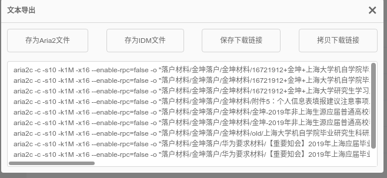

这篇博客的目的是整理ubuntu下一些比较实用的小工具，提高用户的工作效率。
</nbsp>
</nbsp>

---
## 百度网盘文件下载
1. 安装chrome插件[baiduexporter](https://chrome.google.com/webstore/search/BaiduExporter?hl=en-US) 
2. 安装Aria2
Aria2是我目前发现下载百度网盘最快的插件了
```bash
$ sudo apt update 
$ sudo apt install aria2
```
3. 下载文件
    - 使用chrome打开网页端网盘，选择导出**MO.app-文本导出**
     
     
4. 将显示的文件内容复制下来
5. 粘贴到终端，即可下载
```bash
$ aria2c -c -s10 -k1M -x16 --enable-rpc=false -o  ********
```
<nbsp>
<nbsp>

---
## Linux命令搜索工具
1. chrome扩展工具
    - 在chrome商店中安装“开源中国”扩展程序
    - 点击进入扩展程序，点击右上角的**命令**即可搜索Linux的命令用法
    
2. 开源项目
有一个很好的Linux命令搜索的开源项目：[linux-command](https://github.com/jaywcjlove/linux-command) 

---
## vscode
vscode 不仅是一款变成软件，同时还支持markdown文件编辑、预览，支持快速插入目录等操作
1. 下载vscode
点击此处下载[vscode](https://code.visualstudio.com/)
2. 安装markdown插件
在左侧的侧边栏找到扩展资源库，搜索安装 **Markdown TOC**、**Markdown Preview Enhanced**

---
## Typora
Typora是目前公认编写markdown文件最好的编辑器, 最大的特点就是“所见即所得”
安装教程参考：[Typora](https://support.typora.io/Typora-on-Linux/)

```bash
# or use
# sudo apt-key adv --keyserver keyserver.ubuntu.com --recv-keys BA300B7755AFCFAE
$ wget -qO - https://typora.io/linux/public-key.asc | sudo apt-key add -

# add Typora's repository
$ sudo add-apt-repository 'deb https://typora.io/linux ./'
$ sudo apt-get update

# install typora
$ sudo apt-get install typora
```

升级：
```bash
# upgrade all packages include Typora
$ sudo apt-get upgrade
```

通过勾选view中的outline选项可以打开侧边栏，显示文章的目录！