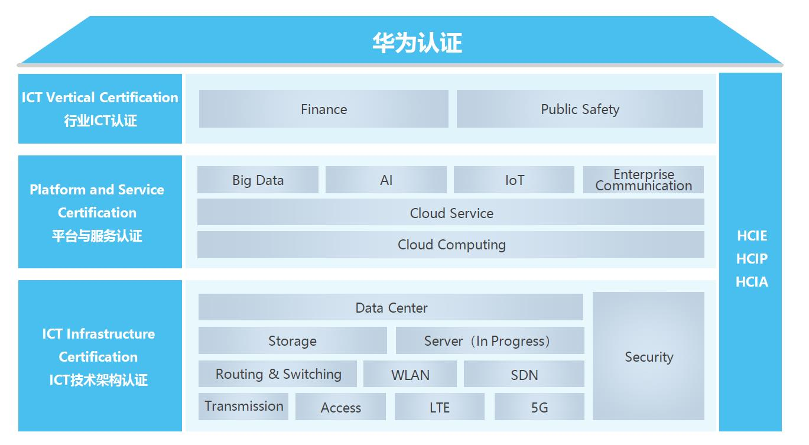
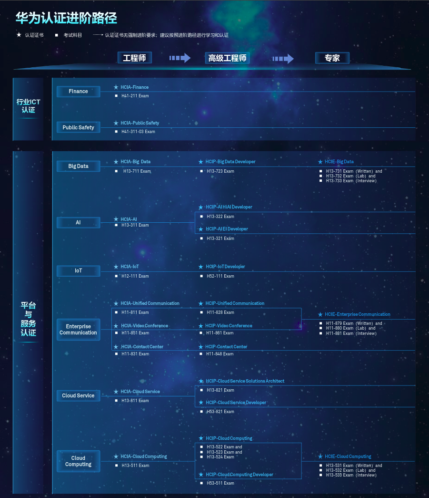
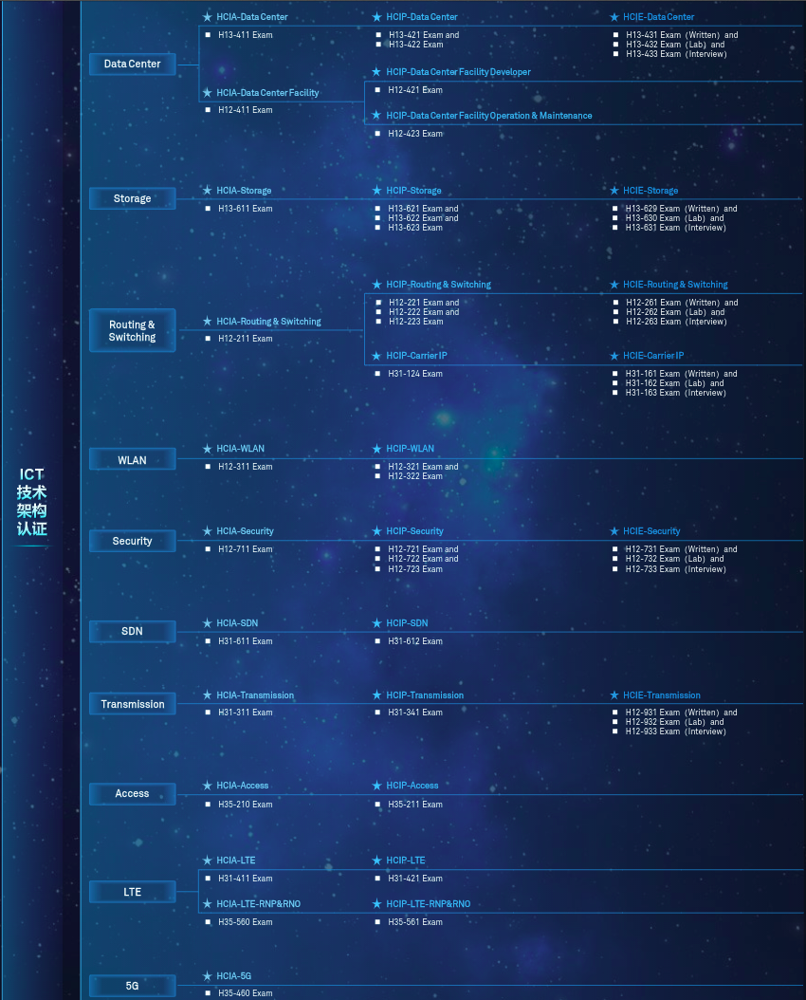

## 华为认证简介

---

### 华为认证介绍

华为认证是华为公司围绕“**云-管-端**”协同的新ICT技术架构，打造的业界唯一覆盖ICT全技术领域的认证体系，包含“ICT技术架构认证”、“平台与服务认证“、“行业ICT认证”三类人才标准。

---

### 华为认证特点

> 华为认证按照**级别**可分为:
>
> - **HCIA**(华为认证ICT工程师)
> - **HCIP**(华为认证ICT高级工程师)
> - **HCIE**(华为认证ICT专家)

>按照**类别**可分为：
>
>- **ICT技术架构认证：**聚焦ICT基础软硬件设施，提供Data Center、Storage、Routing&Switching、WLAN、Security、SDN、Transmission、Access、LTE、5G十个技术方向的能力认证，培养具备基础设施规划、建设和维护能力的专业人才。
>
>- **平台与服务认证：**覆盖AI、IoT、Cloud等新技术领域，提供Big Data、AI、IoT、Enterprise Communication、Cloud Service、Cloud Computing六个技术方向的认证，聚焦培养具备业务、技术、应用融合能力，**能在平台基础上进行创新**的开发型、架构型人才。
>
>- **行业ICT认证：**深入理解行业，提供Finance(金融)、Public Safety两个行业方向的认证，聚焦培养既懂技术，又懂行业的复合型人才。                                      

### 华为认证进阶路径

PS:华为认证已发布18个技术方向的认证产品，其中***路由交换（Routing & Switching）**是基础，建议先获得HCIA路由交换认证，再根据自身的兴趣与岗位需求选择认证方向与认证级别。

华为认证已发布18个技术方向的认证产品，其中路由交换（Routing & Switching）是基础，**建议先获得HCIA路由交换认证**，再根据自身的兴趣与岗位需求选择认证方向与认证级别。