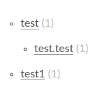

## 安装Hexo
首先检查电脑中是否存在以下应用程序：

1.Git
2.Node.js

终端输入以下命令,检查是否已安装相应程序：
```bash
$ git --version
git version 2.7.4
$ node -v
v12.2.0
```

###  安装Node.js
如果本电脑中有Node.js，可以跳过此步骤；若没有nodejs，则需要先安装.
```bash
//安装nodejs和npm
$ sudo apt-get install nodejs-legacy
$ sudo apt-get install npm
//升级npm为最新
$ sudo npm install npm@latest -g
//安装用于安装nodejs的模块n
$ sudo npm install -g n
//通过n模块安装指定的nodejs
$ sudo n latest
$ sudo n stable
$ sudo n lts
//查看版本
$ node -v
v12.2.0
$ npm -v
6.9.0
```

###  安装Hexo

**使用npm安装Hexo**：
```bash
$ npm install -g hexo-cli
```
*1. ps: 使用npm安装可能会出现“npm ERR! code E404”错误，没关系，多试几次就行*
*2. 若出现以下警告，暂时可以忽略：*
```bash
npm WARN optional SKIPPING OPTIONAL DEPENDENCY: fsevents@1.2.9 (node_modules/hexo-cli/node_modules/fsevents):
npm WARN notsup SKIPPING OPTIONAL DEPENDENCY: Unsupported platform for fsevents@1.2.9: wanted {"os":"darwin","arch":"any"} (current: {"os":"linux","arch":"x64"})
```
**最后测试是否安装完成**:
```bash
$ hexo --version
hexo-cli: 1.1.0
os: Linux 4.15.0-43-generic linux x64
node: 12.2.0
v8: 7.4.288.21-node.17
uv: 1.28.0
zlib: 1.2.11
brotli: 1.0.7
ares: 1.15.0
modules: 72
nghttp2: 1.38.0
napi: 4
llhttp: 1.1.3
http_parser: 2.8.0
openssl: 1.1.1b
cldr: 35.1
icu: 64.2
tz: 2019a
unicode: 12.1
```

### 本地调试Hexo
#### 初始化Hexo本地文件夹
执行下列命令，Hexo会在指定文件夹中新建所需的文件，本博客以为musing_blog为例：
```bash
$ cd ~/
$ mkdir musing_blog
$ hexo init musing_blog
$ cd musing_blog
$ npm install 
```
安装完成后，在终端输入以下命令，最后在浏览器中输入网址http://localhost:4000， 可以看到hexo页面.
</br>

## Github Page托管
这里假设你已经有了github账号，并且为本机地址配置了SSH，如果没有，可以参考我的csdn博客：[ubuntu16下github配置](https://blog.csdn.net/weixin_37058227/article/details/90291368)
**测试github连接是否成功**
```bash
$ SSH -T git@github.com
```
连接成功后，在github上建立一个仓库(repository),仓库名称必须为[github_user].github.io 。例如，本博客建立的仓库名为**musing93.github.io**
### Hexo与github远程关联
#### 配置Deployment
找到musing_blog文件夹下的_config.yml，修改其中的相关代码如下：
>\#Deployment
 \##Docs: https://hexo.io/docs/deployment.html
 deploy:
   type: git
   repo: git@github.com:Musing93/Musing93.github.io.git
   branch: master

#### 本地部署，并提交文件到github
终端输入以下命令：
```bash
#删除旧的public文件
$ hexo clean
#生成新的public文件
$ hexo generate
```
若想先本地查看
```bash
#本地使用浏览器查看博客
hexo s
```
若要在网页上查看：
```bash
#开始部署
hexo deploy
```
*ps:使用deploy需要先安装相关部件：*
```bash
$ npm install hexo-deployer-git --save
```
最后在浏览器中输入[https://github_user.github.io] (https://github_user.github.io) 就可以看到你的简单博客了。可能需要等待一段时间才能访问的，例如本文使用[https://musing93.github.io](https://musing93.github.io) 访问。
### 更换主题
#### 下载主题
hexo中所有主题可在[这里](https://github.com/hexojs/hexo/wiki/Themes)找到;
下载其中的next主题，并将主题放置~/musing93_blog/themes目录下
```bash
$ git clone https://github.com/iissnan/hexo-theme-next.git ~/musing_blog/themes/next
```
#### 修改主题
修改主目录 ~/musing93_blog 下的_config.yml文件，将theme改为next：
```bash
#theme: landscape
theme: next
```
*ps: theme这类栏目的冒号后面要有一个空格*

再修改themes/next目录下的_config.yml文件，选择需要使用的主题：
> \#---------------------------------------------------------------
 \#Scheme Settings
 \#---------------------------------------------------------------
 \#Schemes
 \#scheme: Muse
 \#scheme: Mist
 scheme: Pisces
 \#scheme: Gemini

*ps:本博客选用了next主题的Pisces风格*

### 博客的本地测试与云端查看
博客通常有**本地测试**与**云端查看**两种方式，为了简化以后的操作，可以将相应的终端命令写成bash文件。
#### 本地测试bash文件
**blog_localtest.sh**：
```bash
#!/bin/bash
hexo clean
hexo generate
hexo s
#!/bin/bash
hexo clean
hexo generate
hexo s
```
在终端输入以下命令即可在网址[http://localhost:4000](http://localhost:4000)中查看博客
```bash
$ sh blog_localtest.sh
```
#### 云端查看
将博客传到github可以运行**blog_push.sh**文件，浏览器中输入网址：https://musing93.github.io访问。
**blog_push.sh**:
```bash
#!/bin/bash
hexo clean
hexo generate
hexo deploy
```

## 博客的多端同步
在主电脑中已经建立好了博客，那么在其他电脑上如何查看和编辑呢？
通过github可以实现多端同步，在任意电脑上查看、编辑、更新博客！
### 前期配置
主电脑(A):
添加 /.deploy_git, /public 到.gitignore文件末尾,一个一行
初始化本地仓库,并建立本地仓库与远程仓库的连接：
```bash
$ git init
$ git remote add origin git@github.com:Musing93/Musing93.github.io.git
```
**这里需要注意：如果自己使用的主题是克隆下来的,先把主题下的.git文件夹和.gitignore文件删除,不然git上传不上去**

**如果直接提交，显然会和github上的文件产生冲突、覆盖，因此可以建立github分支hexo，所有的博客更新操作都在分支上进行：**
```bash
#添加所有本地文件
$ git add .
#git 提交
$ git commit -m "备注"
# 新建分支并切换分支
$ git branch hexo
$ git checkout hexo
# 最后push文件到github的hexo分支上
git push origin hexo
```

###  多端同步更新
####  remarkable安装
博客使用markdown语法编写，这里推荐一款markdown编辑器-**remarkable**
首先下载remarkable的[deb](https://remarkableapp.github.io/linux/download.html)安装包,安装：
```bash
$ dpkg -i remarkable_1.87_all.deb 
$ sudo apt-get update
$ sudo apt-get upgrade
$ sudo apt-get install -f   #补足缺失的软件包
$ remarkable &
```
#### 主电脑建立博客并推送到git云端
```bash
$ hexo n new
$ remarkable new.md
```
编写完博客后，将本地更新推送到云端
```bash
$ hexo clean
$ hexo d -g
$ git add .
$ git commit -m "更新test"
$ git push  origin hexo
```
为了方便每一次的更新，可以将推送到云端的命令写成bash文件：
**hexo_git.sh** ：
```bash
#!/bin/bash
hexo clean
hexo d -g
git add .
git commit -m "备注"
git push  origin hexo 
```
或者带参数的**hexo_git_paramerter.sh**
**hexo_git_paramerter.sh**：
```bash
#!/bin/bash
hexo clean
hexo d -g
git add .
git commit -m $1
git push  origin hexo 
```

终端输入下面命令将本地推送到云端：
```bash
sh hexo_git.sh 
#或者
sh hexo_git_paramerter.sh "备注"
```

#### 副电脑下载git文件并更新
1. 在副电脑配置好node.js、git、npm，并配置好git的ssh。
2. 下载文件到本地：
```bash
$ git clone  -b hexo git@github.com:musing93/musing93.github.io
```
3、 对应文件夹下安装npm
```bash
$ npm install
```
4. 新建博客并推送
```bash
$ hexo n new3
$ cd sh
$ sh hexo_git.sh 
```

## 博客详细配置
到此为止，已经初步实现了博客的功能；接下来对博客进行美化。
### 侧边栏添加标签、类别等
标签(tags),时间表(schedule)、类别(categories)、关于(about)
找到next主题下面的_config.yml文件，找到其中的menu配置代码，去掉tags和schedule、categories、about的注释，修改如下：
>menu:
 home: / || home
 about: /about/ || user
 tags: /tags/ || tags
 ategories: /categories/ || th
 archives: /archives/ || archive
 chedule: /schedule/ || calendar


在musing_blog/source文件夹下建立tags与schedule、categories、about文件夹：
```bash
$ hexo n page tags
$ hexo n page schedule
$ hexo n page categories
$ hexo n page about
```
***其他栏目，如about、sitemap等同理。***
运行之前写的本地测试文件查看效果：
```bash
$  sh blog_localtest.sh
```
### 更换语言与头像
1. 更换语言
在musing93_blog目录下的_config.yml文件中修改语言zh-Hans，修改如下：
>#Site
 title: Hexo
 subtitle:
 description:
 keywords:
 author: John Doe
 language: zh-Hans
 timezone:

目前Next支持如下主题：

**code** | **language**
---------| -------------
en | 英语
zh-Hans|大陆简体
zh-Hant-HK|港澳繁體
zh-Hant-TW|台灣正體

2.  修改头像
在musing93_blog目录下的_config.yml文件中修改头像地址：
>
 avatar: /images/avatar.png

***ps:头像地址可以自己新建文件夹，只要路径对就行。最好将自己加入的图片放在自建的文件夹内***

### 设置首页不显示全文(只显示预览)
在musing93_blog目录下的_config.yml文件中修改：
>auto_excerpt:
   enable: true
   length: 150

### 分类和标签设置
这里主要说的是在编写文章的时候，怎么给文章设置标签和分类。
	首先通过hexo n "name"命令来新建一个页面，在source/_posts目录下找到刚才新建的name.md文件，用remarked打开文件，文件内容如下：
>title: name
date: 2019-05-29 13:45:10
tags:

页面默认就是长这样的，可以编辑标题、日期、标签和内容，但是没有分类的选项。我们可以手动加入categories:项,但是下次创建新的页面的时候还是没有，所以我们直接打开scaffolds/post.md文件，在tages:上面加入categories:,保存后，重新执行hexo n 'name'命令，会发现新建的页面里有categories:项了：
>title: name
date: 2019-05-29 13:50:25
tags:

在编辑文章的时候，tags:后面是设置标签的地方，如果有多个标签的话，可以用下面两种办法来设置：
第一种：
>tages: [标签1,标签2,...标签n]
第二种：
> tages: 
\- 标签1
\- 标签2
...
\- 标签n

使用编写好的本地测试sh文件测试，**发现博客虽然知道有多少个标签和分类，但是无法显示**，最后使用如下方法解决：

**在sourse/tags路径下的文件index.md中加入：(缺少了type说明)**
>\---
title: tags
date: 2019-05-28 17:36:37
type: tags
\---

同理，/source/categories下的index.md中加入：
>\---
title: categories
date: 2019-05-29 13:55:58
type: categories
\---

此外还发现，在文章的分类下，若categories配置如下时：
>categories:
\- test
\- test.test

则会生成分类test以及其子类test.test：
 

## 侧边栏社交、打赏、访问统计以及背景设置
打开/theme/next/下的_config.yml文件。
### 打赏：
修改相应代码，图片路径可以自定义：
>\#Reward
reward_comment: 坚持原创技术分享，您的支持将鼓励我继续创作！
wechatpay: /my_images/wechatpay.png
alipay: /my_images/alipay.png

**打赏功能可能存在闪动的bug需要进行修复：**
修改next/source/css/_common/components/post/post-reward.styl，注释掉以下代码：
```bash
/*
#wechat:hover p{
    animation: roll 0.1s infinite linear;
    -webkit-animation: roll 0.1s infinite linear;
    -moz-animation: roll 0.1s infinite linear;
}
#alipay:hover p{
    animation: roll 0.1s infinite linear;
    -webkit-animation: roll 0.1s infinite linear;
    -moz-animation: roll 0.1s infinite linear;
}
#bitcoin:hover p {
    animation: roll 0.1s infinite linear;
    -webkit-animation: roll 0.1s infinite linear;
    -moz-animation: roll 0.1s infinite linear;
}
*/
```


### 订阅公众号
>wechat_subscriber:
  enabled: true
  qcode: /my_images/mywechat.png
  description: 欢迎您扫一扫上面的微信公众号，订阅我的博客！(目前尚未开通公众号0 0)

### 访问量统计
>busuanzi_count:
  \# count values only if the other configs are false
  enable: true
  \# custom uv span for the whole site
  site_uv: true
  site_uv_header: 访客数
  site_uv_footer: 人
  \# custom pv span for the whole site
  site_pv: true
  site_pv_header: 总访问量
  site_pv_footer: 次
  \# custom pv span for one page only
  page_pv: true
  page_pv_header: <i class="fa fa-file-o"></i> 阅读数
  page_pv_footer:

并在themes/next/layout/_partial/footer.swig开头添加如下代码
```bash
<script async src="//busuanzi.ibruce.info/busuanzi/2.3/busuanzi.pure.mini.js"></script>
```
继续在该文件中添加访客统计代码：
```bash

    <script async src="//busuanzi.ibruce.info/busuanzi/2.3/busuanzi.pure.mini.js"></script>
    <span id="busuanzi_container_site_pv">本站总访问量<span id="busuanzi_value_site_pv"></span>次</span>
    <span class="post-meta-divider">|</span>
    <span id="busuanzi_container_site_uv">本站访客数<span id="busuanzi_value_site_uv"></span>人</span>

```
### 配置背景
首先下载背景图片：http://90sheji.com/taobao/256836.html】(http://90sheji.com/taobao/256836.html)
放到 hexo（hexo工程文件）-> themes -> next -> source -> images 的路径下；
hexo（hexo工程文件）-> themes -> next -> source -> css -> _custom ，找到路径下的custom.styl文件，在文件的最上方加上一代码 body { background:url(/images/backGround.jpg（这是你之前加的背景图片的名字）);}就完事了。
(地址可以自己指定)

###关联评论系统
参考官方：[http://theme-next.iissnan.com/third-party-services.html#yungentie](http://theme-next.iissnan.com/third-party-services.html#yungentie)

最后运行之前写好的同步文件，即可本地查看博客、也可同步到云端！

## 注意事项
### 问题1：安装nvm出现“nvm is already installed in /home/jk/.nvm, trying to update using git”

解决办法1（卸载nvm）：
```bash
#Remove nvm,you need to know the nvm path you install .
sudo rm -rf ~/.nvm
hash -r
 
#Remove latest node version
sudo npm uninstall -g n
 
#Remove n
cd ~/src/n && sudo make uninstall && cd .. && sudo rm -r n
 
#Remove latest nodejs version
sudo apt-get purge -y nodejs npm
 
#Remove nodejs-legacy version
sudo apt-get purge -y nodejs-legacy npm
 
sudo apt -y autoremove
 
#Remove nodejs files
sudo rm -rf /usr/local/lib/node_modules/npm
sudo rm -rf /usr/local/lib/node_modules/n
sudo rm -f /usr/local/bin/node
sudo rm -f /usr/local/bin/npm
sudo rm -f /usr/bin/node
sudo rm -rf /usr/local/n/versions/node
```

### 问题2：git提交时报警告“Changes not staged for commit:"
大概率是运行git commit 、 git add 或包含git命令的bash代码时，终端所在的路径不对，应该在musing_blog目录下运行git命令，这样才能提交所有变化的文件！

-----
博客的优化功能还有许多，目前也只是实现了博客的基本内容，后续再继续更新吧！


