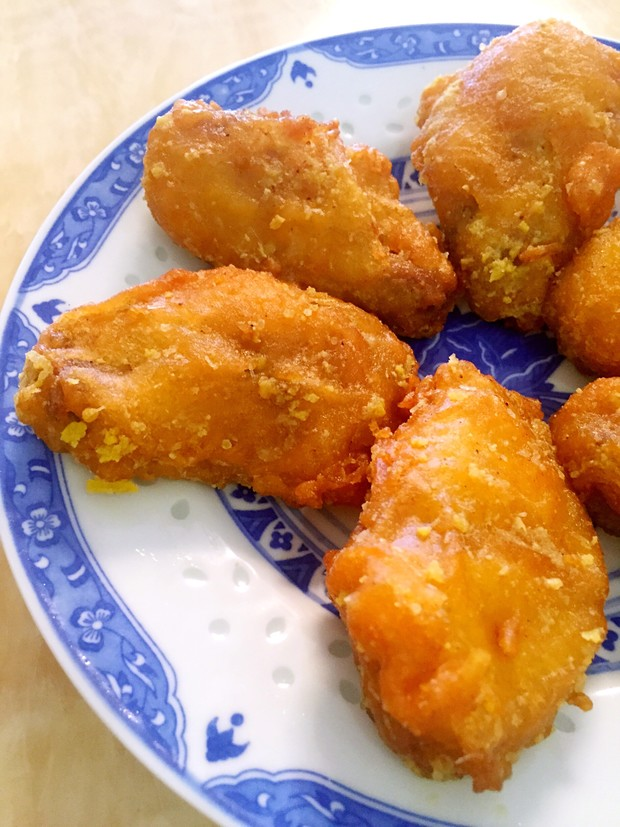
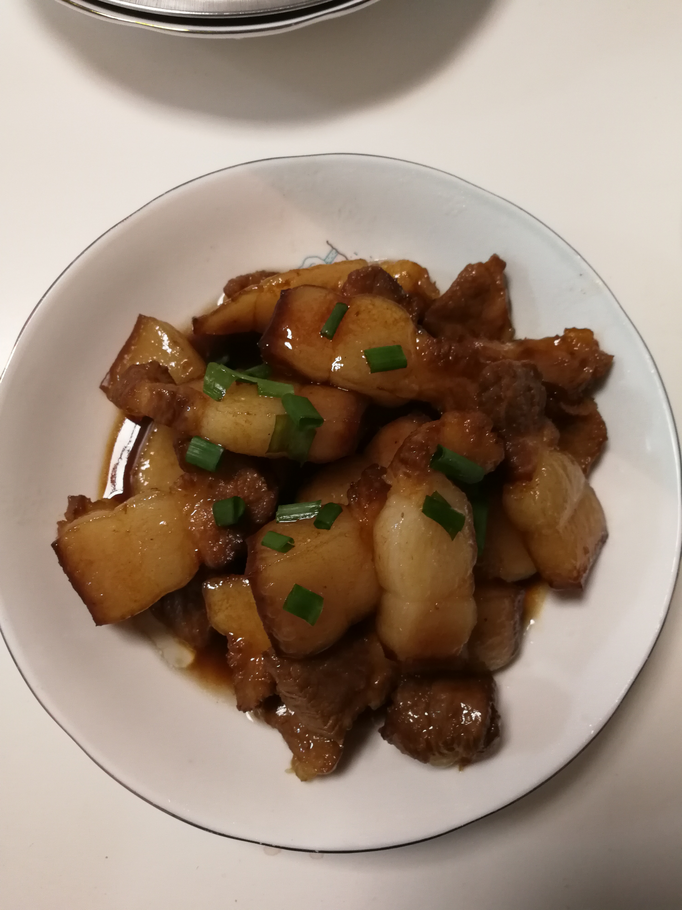
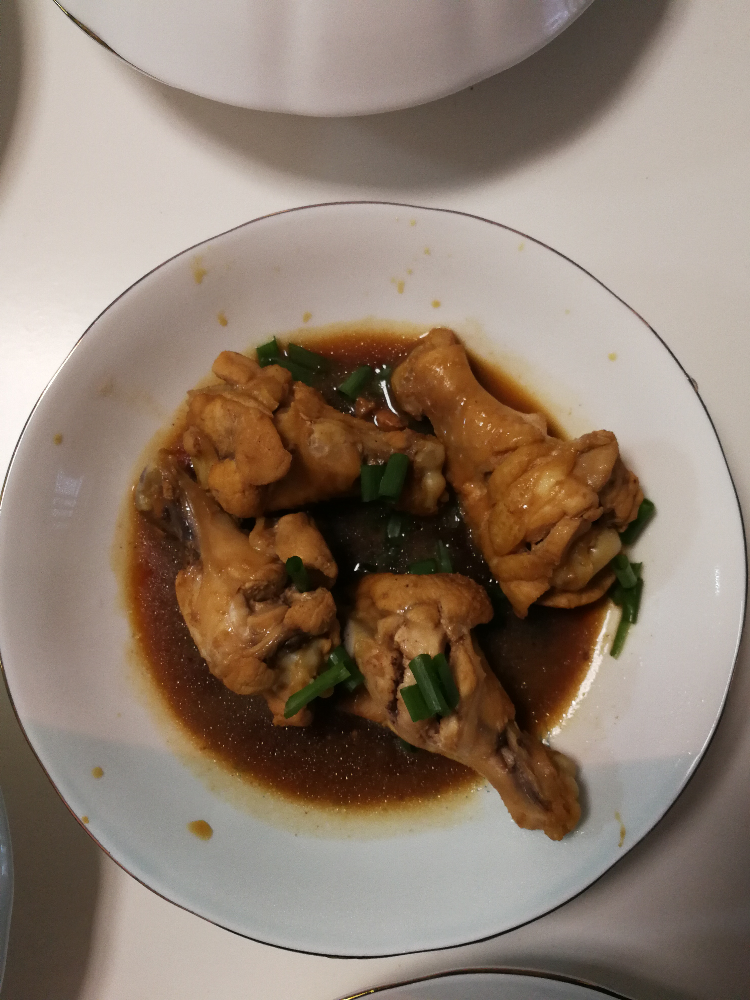
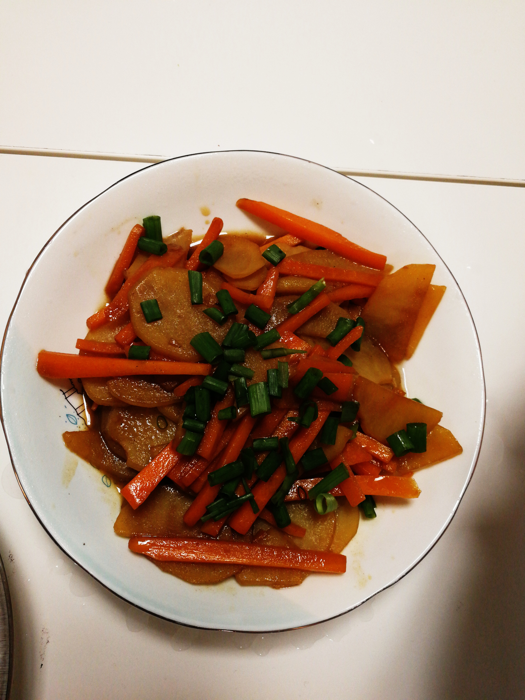

## 摄影

## 菜谱

### 咸蛋黄鸡翅

1. 鸡中翅洗净，牙签戳洞，加盐、料酒腌制
2. 咸蛋黄取蛋黄
3. 热油(7成热)，鸡翅表面拍淀粉
4. 鸡翅下锅炸至金黄后捞出
5. 锅底放底油，加入咸蛋黄翻炒、压碎，加入料酒去腥
6. 蛋黄开始起泡后加入鸡翅，让鸡翅裹满蛋黄

### 红烧肉(无油)

	1. 五花肉切块，洗净
 	2. 锅中放水，放入五花肉，煮至7分熟后捞出
 	3. 洗锅后加入少量水，加入冰糖，熬至粘稠状态
 	4. 放入五花肉翻炒均匀，炒出香味
 	5. 加水至浸没五花肉，加入料酒(适量)、老抽(两锅铲)后盖上锅盖，小火闷煮
 	6. 一段时间后，大火收汁，盛出，撒上切好的小葱

### 红烧鸡腿(无油)

1. 选取鸡腿若干，洗净后将鸡腿两面切若干刀口
2. 锅中加入适量水，烧开，将鸡腿放入，煮出浮沫
3. 鸡腿捞出，洗掉浮沫，重复步骤2
4. 锅中加入适量水，烧开，加入蒜、姜、料酒、糖、老抽和鸡腿(水刚好没过鸡腿)
5. 烧至水快干时，大火翻炒、收汁

### 胡萝卜土豆

1. 土豆切片、胡萝卜切丝
2. 土豆焯水
3. 锅中加油，烧至冒烟后加入土豆翻炒
4. 土豆略软后，加入胡萝卜丝翻炒
5. 加入适量水，锅中食材中间挖空，盖上锅盖闷煮
6. 土豆煮熟后，即可出锅装盘

